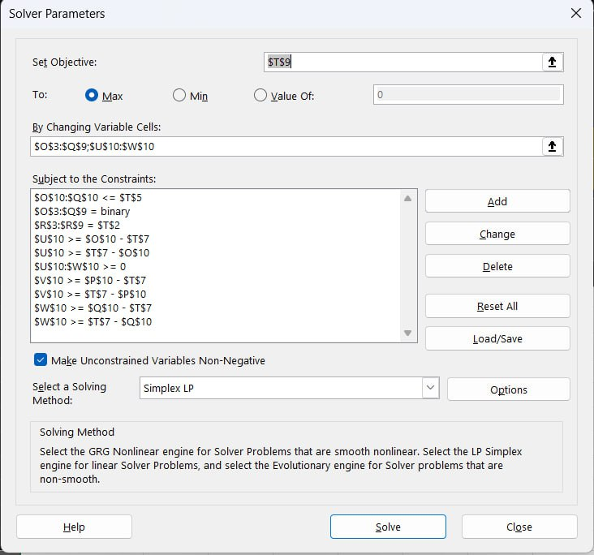

# Фаза 2 (Мета): Распределение работы

## 1. Цель фазы
Целью данной фазы является распределение задач Фазы 3 между участниками команды с учетом двух факторов: максимального удовлетворения личных предпочтений и обеспечения равномерной нагрузки по сложности.

**Исполнители:** Пекшев, Ряховский, Эксперт А.

---

## 2. Постановка задачи оптимизации

Для распределения задач была сформулирована и решена задача целочисленного линейного программирования. 

### 2.1. Целевая функция
Мы максимизируем показатель удовлетворенности команды, из которого вычитается штраф за «перекос» нагрузки:

$$\max \sum_{t} \sum_{p} Pref_{t,p} x_{t,p} - \lambda \sum_{p} |Load_{p} - \overline{Load}|$$

**Обозначения:**
*   $t$ — задача (task);
*   $p$ — исполнитель (person);
*   $Pref_{t,p}$ — балл предпочтения исполнителя $p$ к задаче $t$;
*   $x_{t,p}$ — бинарная переменная (1, если задача $t$ назначена исполнителю $p$, иначе 0);
*   $Load_{p}$ — фактическая суммарная сложность задач, назначенных исполнителю $p$;
*   $\overline{Load}$ — средняя (идеальная) нагрузка на одного человека;
*   $\lambda$ — коэффициент штрафа за отклонение от средней нагрузки (в наших расчетах $\lambda = 1$).

---

## 3. Реализация и линеаризация

Поскольку стандартный метод решения (Simplex LP в Excel Solver) не поддерживает работу с абсолютными значениями (модулем), модель была линеаризована.

### 3.1. Вспомогательные переменные
Для каждого участника введены дополнительные переменные (в таблице это ячейки `U10:W10`), которые заменяют выражение модуля $|Load_{p} - \overline{Load}|$.

### 3.2. Ограничения в Solver
Чтобы модель работала корректно, в Solver были добавлены следующие условия (видны на скриншоте):
1.  **Назначение:** Каждая задача закреплена строго за одним человеком.
2.  **Бинарность:** Переменные $x_{t,p}$ могут принимать значения только 0 или 1.
3.  **Линеаризация модуля:** Для каждой переменной перекоса (например, $U$) заданы два ограничения:
    *   $U \ge (Load_{p} - \overline{Load})$
    *   $U \ge (\overline{Load} - Load_{p})$
    * Это заставляет Solver подбирать значение, равное модулю отклонения от средней нагрузки.

---

## 4. Инструменты и файлы
*   **Метод решения:** Excel Solver, алгоритм Simplex LP.
*   **Файл с расчетами:** [оценки.xlsx](оценки.xlsx)
*   **Параметры модели:**

---

## 5. Результаты распределения
Оптимальное решение позволило достичь целевого значения **38.33**. Нагрузка распределена максимально равномерно относительно среднего значения (17.33 SP).

| Исполнитель | Задачи | Итоговая нагрузка (SP) |
| :--- | :--- | :--- |
| **Пекшев** | T5, T7 | 16 |
| **Ряховский** | T1, T3 | 18 |
| **Эксперт А** | T2, T4, T6 | 18 |
